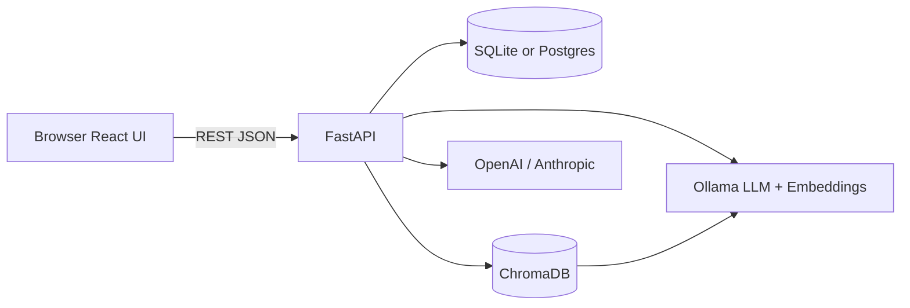

# Architecture — Lenny Growth Assistant

## System context



## Repository layout

```
lenny-growth-assistant/
├── backend/
│   └── app/
│       ├── main.py           # FastAPI app, CORS, migrations hook
│       ├── config.py         # pydantic-settings (.env)
│       ├── database.py       # SQLAlchemy engine + SQLite migrations
│       ├── models.py         # Session, Message (+ optional artifact)
│       ├── schemas.py        # Pydantic API models
│       ├── routers/
│       │   ├── sessions.py   # CRUD sessions
│       │   └── chat.py       # Chat + skill routing
│       ├── agents/
│       │   └── rag.py        # Chroma retrieval
│       └── services/
│           └── llm.py        # Provider abstraction
├── frontend/                 # Vite + React + Tailwind
├── data/                     # Lenny transcript markdown files
└── docs/
```

## Backend components

### Persistence

- **Session** — `id`, `title`, timestamps; one-to-many **Message**.
- **Message** — `role`, `content`, optional `artifact` (for artifact skill replay in UI).
- **Database switch:** `DATABASE_URL` in `.env`. SQLite uses `check_same_thread=False`; Postgres uses standard SQLAlchemy URL (Supabase pooler supported).

### RAG pipeline

1. User message (chat router).
2. `retrieve(query)` → Chroma similarity search (`k=5`).
3. Context injected into skill-specific prompt.
4. Embeddings: `OllamaEmbeddings` (`nomic-embed-text`) against local Ollama.

Vector store path: `backend/chroma_db` (created during indexing — see README).

### LLM layer

`app/services/llm.py` exposes `generate_completion(prompt, max_tokens)`:

| `LLM_PROVIDER` | Backend |
|----------------|---------|
| `ollama` | Ollama `/api/generate` |
| `openai` | Async OpenAI chat completions |
| `anthropic` | Async Anthropic messages API |

Chat router remains unchanged in terms of **skills**; only the transport to the model is pluggable.

### API surface

| Method | Path | Purpose |
|--------|------|---------|
| GET | `/` | Health + provider metadata |
| GET | `/health` | Liveness |
| GET | `/sessions/` | List sessions (summary, no messages) |
| GET | `/sessions/{id}` | Session + ordered messages |
| DELETE | `/sessions/{id}` | Delete session cascade |
| POST | `/sessions/` | Optional explicit session create |
| POST | `/chat/` | Send message; create session if needed |

## Frontend architecture

- **Sidebar** — loads `/sessions/`, supports delete and navigation.
- **Chat pane** — markdown rendering for assistant messages; suggestion chips on empty state.
- **Artifact panel** — right column (~46vw on desktop); `srcDoc` iframe with `min-h-0` flex chain for Chrome; mobile full-height overlay.

State is local React state (no global store) — appropriate for demo scope.

## Security notes (demo)

- CORS is open (`*`) for local dev.
- Artifact iframe uses `sandbox="allow-scripts"` (no same-origin access to parent).
- API keys only in server `.env`, never in frontend.

## Deployment sketch

1. **Backend:** container or PaaS with `DATABASE_URL`, `LLM_PROVIDER`, and keys; run uvicorn.
2. **Frontend:** static build with `VITE_API_URL` pointing to API.
3. **Ollama:** optional sidecar if not using cloud LLM; embeddings still require Ollama unless swapped later.
